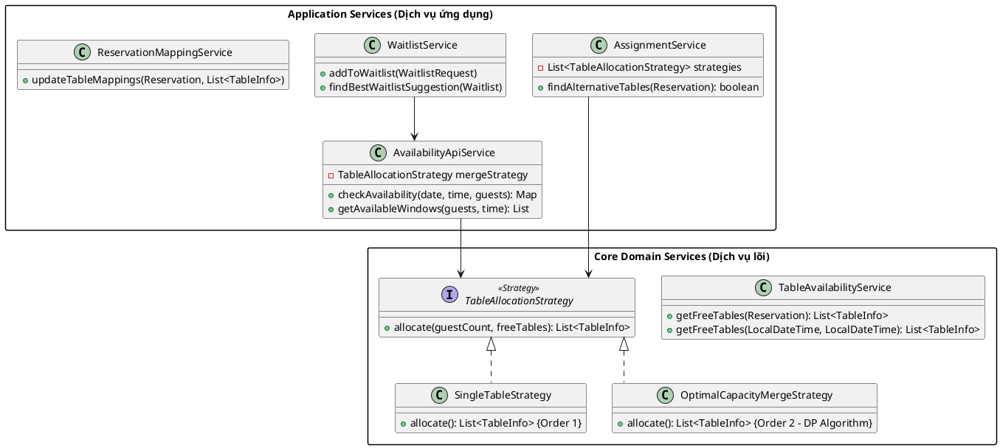

---

# Tài liệu Thiết kế: Module Quản lý Bàn & Điều phối Đặt chỗ

Hệ thống được thiết kế dựa trên các nguyên lý **OOSE** hiện đại, đảm bảo tính dễ mở rộng (Extensibility) thông qua Strategy Pattern và tính nhất quán dữ liệu thông qua việc tách biệt Core Services.

## I. KIẾN TRÚC TỔNG THỂ (UML)

Hệ thống chia làm 2 tầng chính: **Core Domain** (Chứa logic nghiệp vụ dùng chung) và **Application Services** (Chứa các Use Case cụ thể).

---

## II. CHI TIẾT CÁC THÀNH PHẦN

### 1. Nhóm Core Domain (Nền tảng logic)

#### **`TableAvailabilityService.java`**
* **Mục đích:** Là nguồn sự thật duy nhất (Single Source of Truth) về trạng thái trống/bận của bàn.
* **Các hàm chính:**
    * `getFreeTables(Reservation)` & `getFreeTables(start, end)`: Tính toán khung giờ (bao gồm cả `bufferMinutes`) và truy vấn Database để lọc ra danh sách các thực thể `TableInfo` khả dụng, không bị khóa (soft-locked).
* **SOLID:** Tuân thủ **SRP**, tập trung duy nhất vào việc truy vấn dữ liệu thô từ Database.

#### **`TableAllocationStrategy.java` (Interface)**
* **Mục đích:** Định nghĩa "hợp đồng" cho việc tính toán phân bổ bàn.
* **SOLID:** Tuân thủ **DIP (Dependency Inversion)**, giúp các Service cấp cao không phụ thuộc vào thuật toán cụ thể.

#### **`SingleTableStrategy.java`**
* **Mục đích:** Thuật toán ưu tiên tìm 1 bàn đơn duy nhất đủ sức chứa.
* **Thứ tự:** `@Order(1)` - Luôn được chạy trước để tối ưu hóa tài nguyên nhà hàng.

#### **`OptimalCapacityMergeStrategy.java`**
* **Mục đích:** Sử dụng thuật toán **Quy hoạch động (Dynamic Programming)** để tìm tổ hợp ghép bàn tối ưu nhất (ít dư thừa chỗ nhất).
* **SOLID:** Tuân thủ **OCP**, cho phép thay đổi logic ghép bàn phức tạp mà không ảnh hưởng đến luồng gọi.

---

### 2. Nhóm Application Services (Luồng nghiệp vụ)

#### **`AssignmentService.java` (Command Side)**
* **Mục đích:** Thực hiện hành động thay đổi/gán bàn khi khách đến hoặc cần đổi bàn.
* **Hàm chính:** * `findAlternativeTables(Reservation)`: Điều phối việc lấy bàn trống và thử lần lượt các Strategy (Đơn -> Ghép) cho đến khi thành công.
* **SOLID:** Tuân thủ **LSP**, xử lý danh sách `List<TableAllocationStrategy>` một cách đa hình.

#### **`AvailabilityApiService.java` (Query Side)**
* **Mục đích:** Cung cấp dữ liệu tra cứu cho khách hàng (Web) và nhân viên (POS).
* **Hàm chính:**
    * `checkAvailability`: Kiểm tra nhanh và gợi ý giờ thay thế.
    * `getAvailableWindows`: Phân tích real-time bàn trống hoàn toàn/một phần và combo ghép bàn để hiển thị sơ đồ.
* **Thiết kế:** Sử dụng `@Cacheable` để tối ưu hiệu năng tra cứu tần suất cao.

#### **`WaitlistService.java`**
* **Mục đích:** Quản lý danh sách chờ khi nhà hàng hết bàn.
* **Hàm chính:**
    * `findBestWaitlistSuggestion`: Tự động quét các "Available Windows" để gợi ý cho khách trong danh sách chờ ngay khi có bàn trống phù hợp, hỗ trợ cả ngồi ngắn hạn (`allowShortSeating`).

#### **`ReservationMappingService.java` (Infrastructure)**
* **Mục đích:** Quản lý việc ghi xuống Database các mối quan hệ N-N giữa Reservation và Table.
* **Đặc điểm:** Sử dụng `Transactional(propagation = Propagation.MANDATORY)` để đảm bảo tính toàn vẹn dữ liệu trong một phiên làm việc (Atomic).

---

## III. TỔNG KẾT LUỒNG XỬ LÝ (TRACES)

1.  **Tra cứu (Query):** `AvailabilityApiService` -> `TableAvailabilityService` (Lấy dữ liệu) -> `OptimalCapacityMergeStrategy` (Tính toán hiển thị).
2.  **Gán bàn (Command):** `AssignmentService` -> `TableAvailabilityService` (Lấy dữ liệu) -> `Strategies` (Chọn bàn) -> `ReservationMappingService` (Lưu kết quả).
3.  **Hàng đợi (Waitlist):** `WaitlistService` liên tục gọi `AvailabilityApiService` để tìm cơ hội "nhét" khách vào các khoảng trống lịch trình.

---

