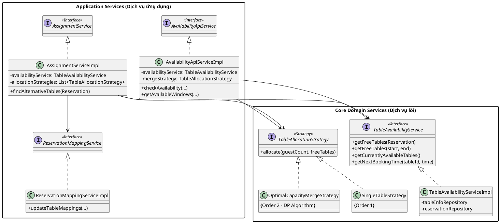

---

# Tài liệu Thiết kế: Module Quản lý Bàn & Điều phối Đặt chỗ

Hệ thống được thiết kế dựa trên các nguyên lý **OOSE** hiện đại, đảm bảo tính dễ mở rộng (Extensibility) thông qua Strategy Pattern, tính nhất quán dữ liệu thông qua Core Services, và đặc biệt tuân thủ chặt chẽ **DIP (Dependency Inversion Principle)** bằng cách tách biệt hoàn toàn Interface và Implementation.

## I. KIẾN TRÚC TỔNG THỂ (UML)

Hệ thống chia làm 2 tầng chính: **Core Domain** (Chứa logic nghiệp vụ lõi dùng chung) và **Application Services** (Chứa các Use Case cụ thể). Tất cả giao tiếp giữa các module đều thông qua **Interface (Bản hợp đồng)**.

---

## II. CHI TIẾT CÁC THÀNH PHẦN

### 1. Nhóm Core Domain (Nền tảng logic)

#### **`TableAvailabilityService` (Interface & Impl)**
* **Mục đích:** Là nguồn sự thật duy nhất (Single Source of Truth) về trạng thái trống/bận của bàn. Nơi duy nhất được quyền gọi Repository để kiểm tra bàn.
* **Các hàm chính:**
    * `getFreeTables(...)`: Lấy bàn trống hoàn toàn theo khung giờ (Hỗ trợ cả object `Reservation` và `thời gian tự do` - Tuân thủ **DRY**).
    * `getCurrentlyAvailableTables()` & `getNextBookingTime(...)`: Hỗ trợ phân tích bàn trống một phần (Partial) cho luồng Real-time POS, giúp **ngăn chặn lỗi N+1 Query Problem**.
* **SOLID:** Tuân thủ **SRP**, tập trung duy nhất vào việc truy vấn dữ liệu thô và xử lý buffer time.

#### **`TableAllocationStrategy` (Interface)**
* **Mục đích:** Định nghĩa "hợp đồng" cho việc tính toán phân bổ bàn.
* **SOLID:** Tuân thủ **OCP**, giúp dễ dàng thay đổi thuật toán xếp bàn mà không chạm vào code của Service gọi nó.

#### **Các Strategy (Impl):**
* **`SingleTableStrategy` (`@Order(1)`):** Thuật toán ưu tiên tìm 1 bàn đơn duy nhất đủ sức chứa. Luôn chạy trước để tối ưu hóa tài nguyên.
* **`OptimalCapacityMergeStrategy` (`@Order(2)`):** Sử dụng thuật toán **Quy hoạch động (Dynamic Programming)** để tìm tổ hợp ghép bàn tối ưu nhất (ít dư thừa chỗ nhất). Được dùng chung cho cả việc Gán bàn và Tra cứu hiển thị (Tuân thủ **DRY**).

---

### 2. Nhóm Application Services (Luồng nghiệp vụ)
*Toàn bộ các service này đều được tách thành Interface (Hợp đồng API) và Impl (Chi tiết cài đặt) để tuân thủ **Dependency Inversion Principle (DIP)**. Controller ở tầng trên chỉ giao tiếp với Interface.*

#### **`AssignmentService` (Command Side)**
* **Mục đích:** Thực hiện hành động thay đổi/gán bàn khi khách đến hoặc cần đổi bàn.
* **Luồng xử lý:** Điều phối việc lấy pool bàn trống (từ Core), thử lần lượt các Strategy đa hình (Đơn -> Ghép) cho đến khi thành công, và gọi DB lưu lại.

#### **`AvailabilityApiService` (Query Side)**
* **Mục đích:** Cung cấp dữ liệu tra cứu cho khách hàng (Web Booking) và nhân viên (Màn hình POS).
* **Luồng xử lý:** * Hoàn toàn **không tương tác trực tiếp với Database**.
    * Chỉ gọi `TableAvailabilityService` để lấy dữ liệu thô, sau đó "xào nấu", phân tích (Trống hoàn toàn / Trống một phần) và truyền qua Strategy để lấy gợi ý ghép bàn.
* **Thiết kế:** Sử dụng `@Cacheable` để tối ưu hiệu năng tra cứu tần suất cao.

#### **`ReservationMappingService` (Infrastructure)**
* **Mục đích:** Quản lý việc ghi xuống Database các mối quan hệ N-N giữa Reservation và Table.
* **Đặc điểm:** Sử dụng `@Transactional(propagation = Propagation.MANDATORY)` để đảm bảo tính toàn vẹn dữ liệu (Atomic). Tách biệt logic ORM/JPA khỏi logic tính toán nghiệp vụ.

---

## III. TỔNG KẾT TƯ DUY KIẾN TRÚC

Kiến trúc hiện tại đạt được các tiêu chuẩn Enterprise khắt khe nhất:
1.  **Highly Cohesive (Độ gắn kết cao):** Mọi logic liên quan đến thời gian dọn dẹp (`bufferMinutes`) hay thao tác tính bàn đều được gom về một mối duy nhất (Core Service).
2.  **Loosely Coupled (Độ ghép nối lỏng):** Các module cấp cao (Application Services) không hề biết Database bên dưới dùng MySQL hay MongoDB, cũng không biết thuật toán ghép bàn code bằng for-loop hay Quy hoạch động. Chúng chỉ quan tâm đến các Interface.
3.  **CQRS Pattern:** Tách biệt rõ ràng luồng Đọc/Tra cứu tần suất cao (`AvailabilityApiService`) và luồng Ghi/Gán bàn (`AssignmentService`).

---
*Tài liệu được cập nhật dựa trên quy trình Tái cấu trúc (Refactoring) OOSE & SOLID mới nhất.*

---